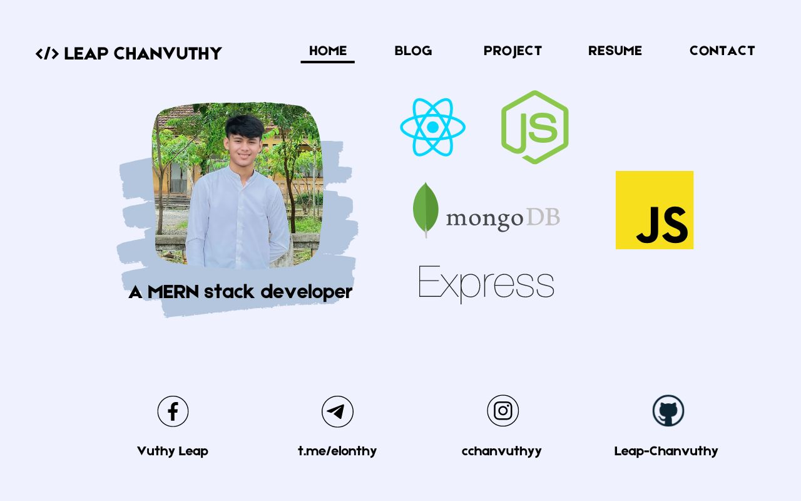

<h1 align="center">Hi 👋, I'm Leap Chanvuthy</h1>
<h3 align="center">I'm passionate in Software development and Explore new technology to build up my career and projects .</h3>

- 🌱 I’m currently learning **React for Frontend and Node , Express for Backend**

- 💬 Ask me about **MERN Stacks**

- 📫 Contact me via **chanvuthy.leap@student.cadt.edu.kh**

- ⚡ Fun fact **Love taking Astrophotography and self-learning Astronomy**

<h3 align="left">Connect with me:</h3>

<h3 align="left">Languages and Tools:</h3>

          

&nbsp;

